# CORS Middleware

## Overview

This example shows application of [CORS: Cross-Origin Resource Sharing](https://en.wikipedia.org/wiki/Cross-origin_resource_sharing).
CORS restricts cross-origin API requests.

CORSMiddleware works as server-side middleware.


**Legend**:

- 🟥 `#ff6961` Handler resources.
- 🟩 `#77dd77` Middleware resources (Server-side middleware).
- 🟦 `#89CFF0` Tripperware resources (Client-side middleware).
- 🟪 `#9370DB` Other resources.

In this example, following directory structure and files are supposed.
If you need a pre-built binary, download from [GitHub Releases](https://github.com/aileron-gateway/aileron-gateway/releases).

```txt
cors/             ----- Working directory.
├── aileron       ----- AILERON Gateway binary (aileron.exe on windows).
└── config.yaml   ----- AILERON Gateway config file.
```

## Config

Configuration yaml to run a server with CORS middleware becomes as follows.

```yaml
# config.yaml

apiVersion: core/v1
kind: Entrypoint
spec:
  runners:
    - apiVersion: core/v1
      kind: HTTPServer

---
apiVersion: core/v1
kind: HTTPServer
spec:
  addr: ":8080"
  virtualHosts:
    - middleware:
        - apiVersion: app/v1
          kind: CORSMiddleware
      handlers:
        - handler:
            apiVersion: app/v1
            kind: EchoHandler

---
apiVersion: app/v1
kind: EchoHandler

---
apiVersion: app/v1
kind: CORSMiddleware
spec:
  corsPolicy:
    allowedOrigins:
      - "http://localhost:8080"
      - "http://example.com"
    allowedMethods:
      - GET
      - HEAD
```

The config tells:

- Start a `HTTPServer` with port 8080.
- An echo handler is applied.
- Cross-origin requests are limited by CORSMiddleware.
  - Allow origins `http://localhost:8080` and `http://example.com`
  - Allow methods `GET` and `HEAD`

This graph shows the resource dependencies of the configuration.

```mermaid
graph TD
  Entrypoint["🟪 **Entrypoint**</br>default/default"]
  HTTPServer["🟪 **HTTPServer**</br>default/default"]
  EchoHandler["🟥 **EchoHandler**</br>default/default"]
  CORSMiddleware["🟩 **CORSMiddleware**</br>default/default"]

Entrypoint --"Runner"--> HTTPServer
HTTPServer --"HTTP Handler"--> EchoHandler
HTTPServer --"Middleware"--> CORSMiddleware

style EchoHandler stroke:#ff6961,stroke-width:2px
style CORSMiddleware stroke:#77dd77,stroke-width:2px
```



## Run

Run the AILEROn Gateway with command:

```bash
./aileron -f ./config.yaml
```

## Check

After runngin the server, send HTTP requests with `Origin` header.

`GET` requests with `Origin http://localhost:8080` is allowed.
See the following curl example.

```bash
$ curl -H "Origin: http://localhost:8080" http://localhost:8080 -v

> GET / HTTP/1.1
> Host: localhost:8080
> User-Agent: curl/8.12.1
> Accept: */*
> Origin: http://localhost:8080

< HTTP/1.1 200 OK
< Access-Control-Allow-Headers: Content-Type,X-Requested-With
< Access-Control-Allow-Methods: GET,HEAD
< Access-Control-Allow-Origin: http://localhost:8080
< Content-Type: text/plain;charset=utf-8
< Vary: Origin
< X-Content-Type-Options: nosniff
< Date: Fri, 23 May 2025 09:42:54 GMT
< Content-Length: 343

---------- Request ----------

~~~ output omitted ~~~

--------------------------
```

`GET` requests with `Origin http://malicious.origin` is not allowed.
See the following curl example.

```bash
$ curl -H "Origin: http://malicious.origin" http://localhost:8080

{"status":403,"statusText":"Forbidden"}
```

`POST` requests from any origin are not allowed as follows.

```bash
$ curl -XPOST -H "Origin: http://localhost:8080" http://localhost:8080

{"status":403,"statusText":"Forbidden"}
```
