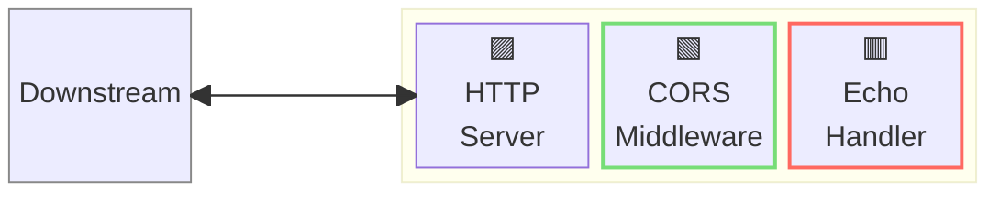
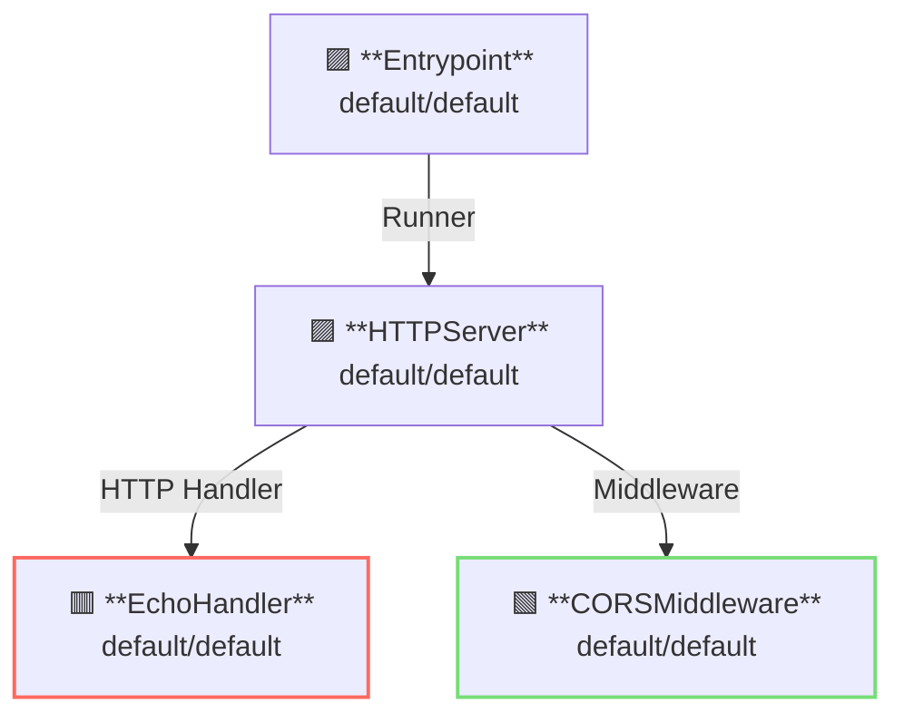

# CORS Middleware

## 概要

この例は、[CORS: クロスオリジンリソース共有](https://ja.wikipedia.org/wiki/Cross-origin_resource_sharing) の利用方法を示しています。  
CORSはクロスオリジンのAPIリクエストを制限します。

CORSMiddlewareはサーバーサイドミドルウェアとして動作します。



**凡例**:

- 🟥 `#ff6961` ハンドラーリソース
- 🟩 `#77dd77` ミドルウェアリソース（サーバー側ミドルウェア）
- 🟦 `#89CFF0` トリッパーウェアリソース（クライアント側ミドルウェア）
- 🟪 `#9370DB` その他のリソース

この例では、以下のディレクトリ構成とファイルが想定されています。  
ビルド済みのバイナリが必要な場合は、[GitHub Releases](https://github.com/aileron-gateway/aileron-gateway/releases) からダウンロードしてください。

```txt
cors/             ----- Working directory.
├── aileron       ----- AILERON Gateway binary (aileron.exe on windows).
└── config.yaml   ----- AILERON Gateway config file.
```

## Config

CORS ミドルウェア付きでサーバーを実行するための設定 YAML は次のようになります。

```yaml
# config.yaml

apiVersion: core/v1
kind: Entrypoint
spec:
  runners:
    - apiVersion: core/v1
      kind: HTTPServer

---
apiVersion: core/v1
kind: HTTPServer
spec:
  addr: ":8080"
  virtualHosts:
    - middleware:
        - apiVersion: app/v1
          kind: CORSMiddleware
      handlers:
        - handler:
            apiVersion: app/v1
            kind: EchoHandler

---
apiVersion: app/v1
kind: EchoHandler

---
apiVersion: app/v1
kind: CORSMiddleware
spec:
  corsPolicy:
    allowedOrigins:
      - "http://localhost:8080"
      - "http://example.com"
    allowedMethods:
      - GET
      - HEAD
```

この設定は次の内容を示しています：

- ポート8080で `HTTPServer` を起動します。
- エコーハンドラーが適用されます。
- クロスオリジンリクエストは `CORSMiddleware` によって制限されます。
  - 許可されるオリジンは `http://localhost:8080` と `http://example.com`
  - 許可されるメソッドは `GET` と `HEAD`

このグラフは、設定におけるリソースの依存関係を示しています。



## Run

以下のコマンドで AILERON Gateway を起動します：

```bash
./aileron -f ./config.yaml
```

## Check

サーバーを起動したら、`Origin` ヘッダーを付けて HTTP リクエストを送信してください。

`Origin: http://localhost:8080` の `GET` リクエストは許可されます。  
以下の curl の例を参照してください。

```bash
$ curl -H "Origin: http://localhost:8080" http://localhost:8080 -v

> GET / HTTP/1.1
> Host: localhost:8080
> User-Agent: curl/8.12.1
> Accept: */*
> Origin: http://localhost:8080

< HTTP/1.1 200 OK
< Access-Control-Allow-Headers: Content-Type,X-Requested-With
< Access-Control-Allow-Methods: GET,HEAD
< Access-Control-Allow-Origin: http://localhost:8080
< Content-Type: text/plain;charset=utf-8
< Vary: Origin
< X-Content-Type-Options: nosniff
< Date: Fri, 23 May 2025 09:42:54 GMT
< Content-Length: 343

---------- Request ----------

~~~ output omitted ~~~

--------------------------
```

`Origin: http://malicious.origin` の `GET` リクエストは許可されません。  
以下の curl の例を参照してください。

```bash
$ curl -H "Origin: http://malicious.origin" http://localhost:8080

{"status":403,"statusText":"Forbidden"}
```

`POST` リクエストはどのOriginからも許可されていないため以下のようになります。

```bash
$ curl -XPOST -H "Origin: http://localhost:8080" http://localhost:8080

{"status":403,"statusText":"Forbidden"}
```
