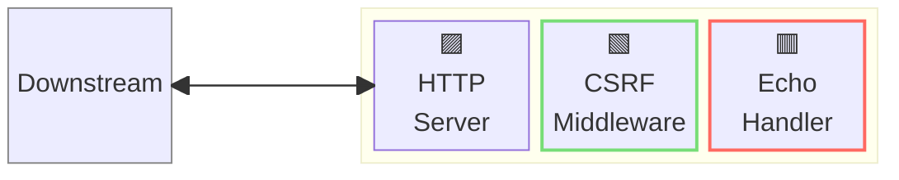
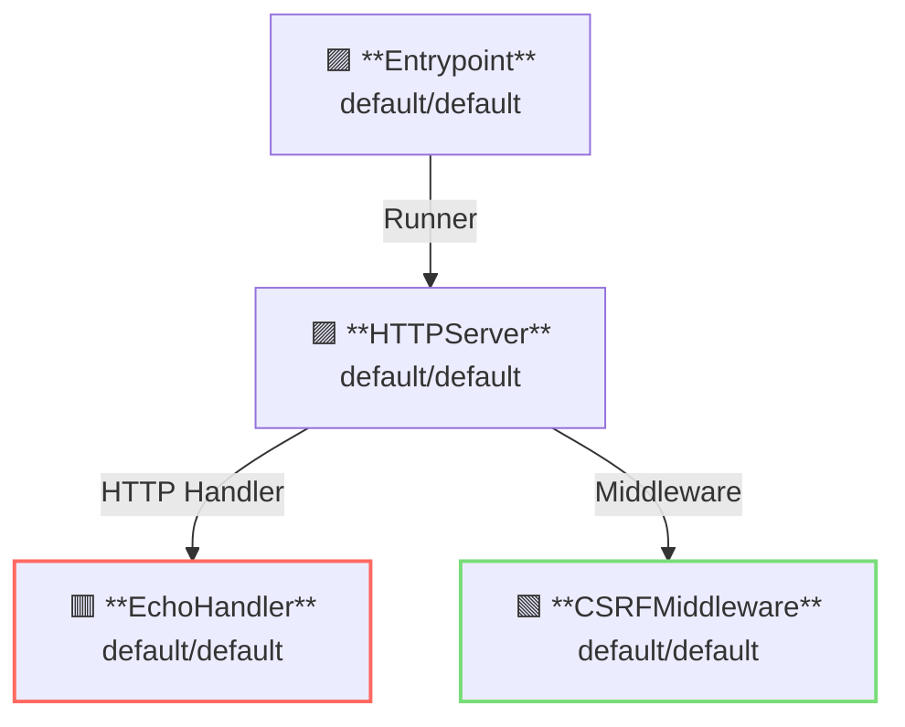

# CSRF Middleware

## 概要

この例では、[CSRF: Cross-Site Request Forgery](https://en.wikipedia.org/wiki/Cross-site_request_forgery) の適用方法を示します。  
CSRF はクロスサイトからの API リクエストを制限します。



**凡例**:

- 🟥 `#ff6961` ハンドラーリソース
- 🟩 `#77dd77` ミドルウェアリソース（サーバー側ミドルウェア）
- 🟦 `#89CFF0` トリッパーウェアリソース（クライアント側ミドルウェア）
- 🟪 `#9370DB` その他のリソース

この例では、以下のディレクトリ構成とファイルが想定されています。  
ビルド済みのバイナリが必要な場合は、[GitHub Releases](https://github.com/aileron-gateway/aileron-gateway/releases) からダウンロードしてください。

```txt
csrf/            ----- 作業ディレクトリ
├── aileron      ----- AILERON Gateway バイナリ（Windowsの場合は aileron.exe）
└── config.yaml  ----- AILERON Gateway 設定ファイル
```

## Config

CSRF ミドルウェア付きでサーバーを実行するための YAML は次のようになります。

```yaml
# config.yaml

apiVersion: core/v1
kind: Entrypoint
spec:
  runners:
    - apiVersion: core/v1
      kind: HTTPServer

---
apiVersion: core/v1
kind: HTTPServer
spec:
  addr: ":8080"
  virtualHosts:
    - handlers:
        - middleware:
            - apiVersion: app/v1
              kind: CSRFMiddleware
          handler:
            apiVersion: app/v1
            kind: EchoHandler

---
apiVersion: app/v1
kind: EchoHandler

---
apiVersion: app/v1
kind: CSRFMiddleware
spec:
  customRequestHeader:
    headerName: "__csrfToken"
    allowedPattern: "^localhost$"
```

この設定は次の内容を示しています：

- ポート8080で `HTTPServer` を起動します。
- エコーハンドラーが適用されます。
- クロスサイトリクエストは `CSRFMiddleware` によって制限されます。
  - [カスタムリクエストヘッダー](https://cheatsheetseries.owasp.org/cheatsheets/Cross-Site_Request_Forgery_Prevention_Cheat_Sheet.html) によって CSRF を防止します。
  - ヘッダー名は `__csrfToken` を使用します。
  - 許可されるヘッダー値のパターンは `^localhost$` です。

このグラフは、設定におけるリソースの依存関係を示しています。



## Run

以下のコマンドで AILERON Gateway を起動します：

```bash
./aileron -f ./config.yaml
```

## Check

サーバーを起動したら、カスタムヘッダー `__csrfToken` を付けて HTTP リクエストを送信してください。

ヘッダーの値が `localhost` の場合は許可されます。

```bash
$ curl -H "__csrfToken: localhost" http://localhost:8080

---------- Request ----------
Proto   : HTTP/1.1
Host   : localhost:8080
Method : GET
URI    : /
Path   : /
Query  :
Remote : [::1]:45564
---------- Header ----------
{
  "Accept": [
    "*/*"
  ],
  "User-Agent": [
    "curl/8.12.1"
  ],
  "__csrftoken": [
    "localhost"
  ]
}
---------- Body ----------

--------------------------
```

カスタムヘッダーが付いていないリクエスト、または許可されていないヘッダー値のパターンの場合は拒否されます。

```bash
$ curl -H "__csrfToken: example.com" http://localhost:8080

{"status":403,"statusText":"Forbidden"}
```
