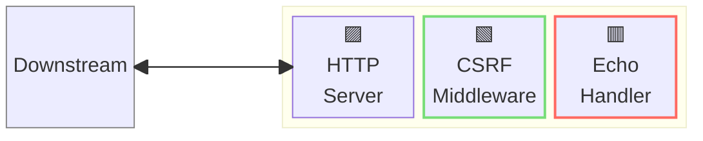
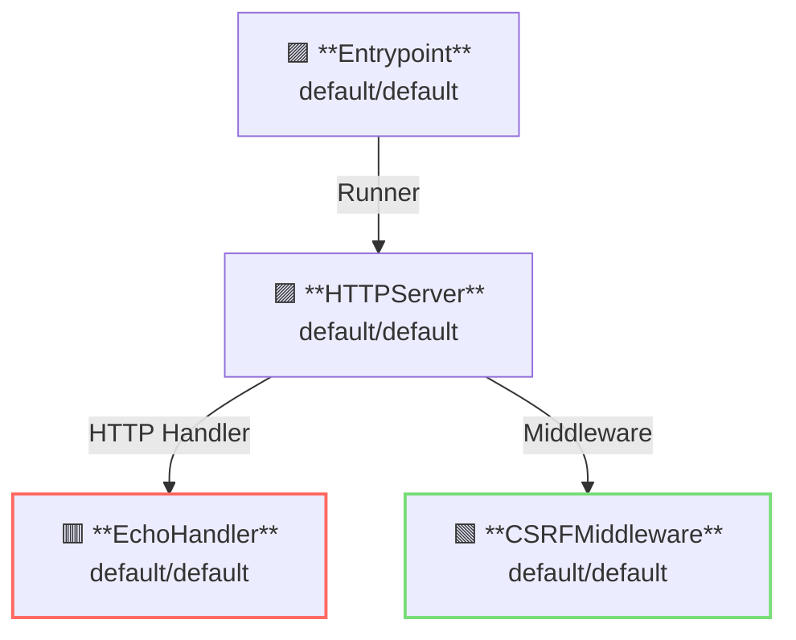

# CSRF Middleware

## Overview

This example shows application of [CSRF: Cross-Site Request Forgery](https://en.wikipedia.org/wiki/Cross-site_request_forgery).
CSRF restricts cross-site API requests.



**Legend**:

- 🟥 `#ff6961` Handler resources.
- 🟩 `#77dd77` Middleware resources (Server-side middleware).
- 🟦 `#89CFF0` Tripperware resources (Client-side middleware).
- 🟪 `#9370DB` Other resources.

In this example, following directory structure and files are supposed.
If you need a pre-built binary, download from [GitHub Releases](https://github.com/aileron-gateway/aileron-gateway/releases).

```txt
csrf/            ----- Working directory.
├── aileron      ----- AILERON Gateway binary (aileron.exe on windows).
└── config.yaml  ----- AILERON Gateway config file.
```

## Config

Configuration yaml to run a server with CSRF middleware becomes as follows.

```yaml
# config.yaml

apiVersion: core/v1
kind: Entrypoint
spec:
  runners:
    - apiVersion: core/v1
      kind: HTTPServer

---
apiVersion: core/v1
kind: HTTPServer
spec:
  addr: ":8080"
  virtualHosts:
    - handlers:
        - middleware:
            - apiVersion: app/v1
              kind: CSRFMiddleware
          handler:
            apiVersion: app/v1
            kind: EchoHandler

---
apiVersion: app/v1
kind: EchoHandler

---
apiVersion: app/v1
kind: CSRFMiddleware
spec:
  customRequestHeader:
    headerName: "__csrfToken"
    allowedPattern: "^localhost$"
```

The config tells:

- Start a `HTTPServer` with port 8080.
- An echo handler is applied.
- Cross-site requests are limited by CSRFMiddleware.
  - Prevent CSRFF with [Custom Request Header](https://cheatsheetseries.owasp.org/cheatsheets/Cross-Site_Request_Forgery_Prevention_Cheat_Sheet.html)
  - Use `__csrfToken` header name.
  - Allowed header value pattern is `^localhost$`.

This graph shows the resource dependencies of the configuration.



## Run

Run the AILERON Gateway with command:

```bash
./aileron -f ./config.yaml
```

## Check

After running the server, send HTTP requests with the custom header `__csrfToken`.

Header value `localhost` should be allowed.

```bash
$ curl -H "__csrfToken: localhost" http://localhost:8080

---------- Request ----------
Proto   : HTTP/1.1
Host   : localhost:8080
Method : GET
URI    : /
Path   : /
Query  :
Remote : [::1]:45564
---------- Header ----------
{
  "Accept": [
    "*/*"
  ],
  "User-Agent": [
    "curl/8.12.1"
  ],
  "__csrftoken": [
    "localhost"
  ]
}
---------- Body ----------

--------------------------
```

Requests without custom header or dis-allowed header value pattern are forbidden.

```bash
$ curl -H "__csrfToken: example.com" http://localhost:8080

{"status":403,"statusText":"Forbidden"}
```
