# CSRF Middleware

## Overview

This example shows application of [CSRF: Cross-Site Request Forgery](https://en.wikipedia.org/wiki/Cross-site_request_forgery).
CSRF restricts cross-site API requests.

```mermaid
block-beta
  columns 5
  Downstream:1
  space:1
  block:aileron:3
    HTTPServer["🟪</br>HTTP</br>Server"]
    CSRFMiddleware["🟩</br>CSRF</br>Middleware"]
    EchoHandler["🟥</br>Echo</br>Handler"]
  end

Downstream --> HTTPServer
HTTPServer --> Downstream

style Downstream stroke:#888
style EchoHandler stroke:#ff6961,stroke-width:2px
style CSRFMiddleware stroke:#77dd77,stroke-width:2px
```



**Legend**:

- 🟥 `#ff6961` Handler resources.
- 🟩 `#77dd77` Middleware resources (Server-side middleware).
- 🟦 `#89CFF0` Tripperware resources (Client-side middleware).
- 🟪 `#9370DB` Other resources.

In this example, following directory structure and files are supposed.

Resources are available at [examples/cors/](https://github.com/aileron-gateway/aileron-gateway/tree/main/examples/cors).
If you need a pre-built binary, download from [GitHub Releases](https://github.com/aileron-gateway/aileron-gateway/releases).

```txt
access-logging/    ----- Working directory.
├── aileron        ----- AILERON Gateway binary (aileron.exe on windows).
├── config.yaml    ----- AILERON Gateway config file.
└── Taskfile.yaml  ----- (Optional) Config file for the go-task.
```

## Config

Configuration yaml to run a server with CSRF middleware becomes as follows.

```yaml
# config.yaml

{}
```

The config tells:

- Start a `HTTPServer` with port 8080.
- An echo handler is applied.
- Cross-site requests are limited by CSRFMiddleware.
  - Prevent CSRFF with [Custom Request Header](https://cheatsheetseries.owasp.org/cheatsheets/Cross-Site_Request_Forgery_Prevention_Cheat_Sheet.html)
  - Use `__csrfToken` header name.
  - Allowed header value pattern is `^localhost$`.

This graph shows the resource dependencies of the configuration.

```mermaid
graph TD
  Entrypoint["🟪 **Entrypoint**</br>default/default"]
  HTTPServer["🟪 **HTTPServer**</br>default/default"]
  EchoHandler["🟥 **EchoHandler**</br>default/default"]
  CSRFMiddleware["🟩 **CSRFMiddleware**</br>default/default"]

Entrypoint --> HTTPServer
HTTPServer --> EchoHandler
HTTPServer --> CSRFMiddleware

style EchoHandler stroke:#ff6961,stroke-width:2px
style CSRFMiddleware stroke:#77dd77,stroke-width:2px
```



## Run

### (Option 1) Directory run the binary

```bash
./aileron -f ./config.yaml
```

### (Option 2) Use taskfile

`Taskfile.yaml` is available to run the example.
Install [go-task](https://taskfile.dev/) and run the following command.

```bash
task
```

or with arbitrary binary path.

```bash
task AILERON_CMD="./path/to/aileron/binary"
```

## Check

After running the server, send HTTP requests with the custom header `__csrfToken`.

Header value `localhost` should be allowed.

```bash
$ curl -H "__csrfToken: localhost" http://localhost:8080

---------- Request ----------
Proto   : HTTP/1.1
Host   : localhost:8080
Method : GET
URI    : /
Path   : /
Query  :
Remote : [::1]:45564
---------- Header ----------
{
  "Accept": [
    "*/*"
  ],
  "User-Agent": [
    "curl/8.12.1"
  ],
  "__csrftoken": [
    "localhost"
  ]
}
---------- Body ----------

--------------------------
```

Requests without custom header or dis-allowed header value pattern are forbidden.

```bash
$ curl -H "__csrfToken: example.com" http://localhost:8080

{"status":403,"statusText":"Forbidden"}
```
