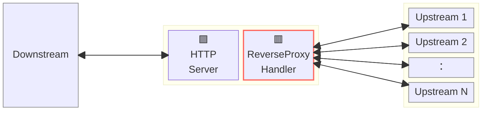
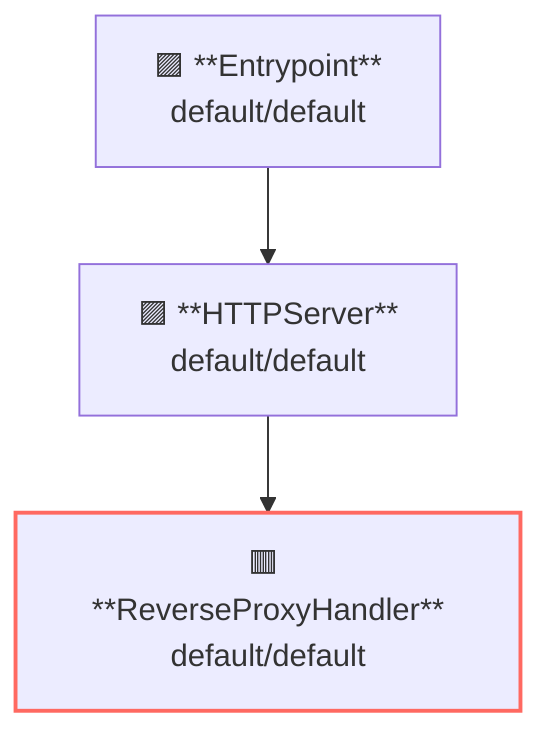

# Reverse Proxy (Load Balancing)

## Overview

This example runs a reverse-proxy server that proxy requests with various loadbalancing algorithm.



**Legend**:

- 🟥 `#ff6961` Handler resources.
- 🟩 `#77dd77` Middleware resources (Server-side middleware).
- 🟦 `#89CFF0` Tripperware resources (Client-side middleware).
- 🟪 `#9370DB` Other resources.

In this example, following directory structure and files are supposed.

Resources are available at [examples/proxy-loadbalancing/](https://github.com/aileron-gateway/aileron-gateway/tree/main/examples/proxy-loadbalancing).
If you need a pre-built binary, download from [GitHub Releases](https://github.com/aileron-gateway/aileron-gateway/releases).

```txt
proxy-loadbalancing/         ----- Working directory.
├── aileron                  ----- AILERON Gateway binary (aileron.exe on windows).
├── config-direct-hash.yaml  ----- Config that uses Direct Hash algorithm.
├── config-maglev.yaml       ----- Config that uses Maglev Hash algorithm.
├── config-random.yaml       ----- Config that uses (Weighted) Random algorithm.
├── config-ring-hash.yaml    ----- Config that uses Ring Hash algorithm.
├── config-round-robin.yaml  ----- Config that uses (Weighted) Round Robin algorithm.
├── server.go                ----- Example upstream servers. 5 servers are run.
└── Taskfile.yaml            ----- (Optional) Config file for the go-task.
```

## Config

Configuration yaml to run a reverse-proxy server for round-robin loadbalancer would becomes as follows.

```yaml
# config-round-robin.yaml

{}
```

The config tells:

- Start a `HTTPServer` with port 8080.
- ReverseProxy is applied for the path having prefix `/` (matches all).
- Upstream service is `:8081`~`:8085`.
- Use the `RoundRobin` loadbalancing algorithm.

This graph shows the resource dependencies of the configuration.



## Run

### (Option 1) Directory run the binary

```bash
./aileron -f ./config-round-robin.yaml
```

Or

- Direct Hash: `./aileron -f ./config-direct-hash.yaml`
- Maglev: `./aileron -f ./config-maglev.yaml`
- Random: `./aileron -f ./config-random.yaml`
- Ring Hash: `./aileron -f ./config-ring-hash.yaml`
- Round Robin: `./aileron -f ./config-round-robin.yaml`

### (Option 2) Use taskfile

`Taskfile.yaml` is available to run the example.
Install [go-task](https://taskfile.dev/) and run the following command.

```bash
task
```

or with arbitrary binary path.

```bash
task AILERON_CMD="./path/to/aileron/binary"
```

## Check

After running a reverse-proxy server and upstream servers, send HTTP requests to the proxy.

AILERON Gateway proxies requests to upstreams with selected loadbalancing algorithm (Round Robin here).

```bash
$ curl http://localhost:8080
Server :8001

$ curl http://localhost:8080
Server :8002

$ curl http://localhost:8080
Server :8003

$ curl http://localhost:8080
Server :8004

$ curl http://localhost:8080
Server :8005

$ curl http://localhost:8080
Server :8001

$ curl http://localhost:8080
Server :8002

$ curl http://localhost:8080
Server :8003

$ curl http://localhost:8080
Server :8004

$ curl http://localhost:8080
Server :8005
```
