# Reverse Proxy (Load Balancing)

## Overview

This example runs a reverse-proxy server that proxy requests with various loadbalancing algorithm.

```mermaid
block-beta
  columns 6
  Downstream:1
  space:1
  block:aileron:2
    HTTPServer["🟪</br>HTTP</br>Server"]
    ReverseProxyHandler["🟥</br>ReverseProxy</br>Handler"]
  end
  space:1
  block:upstream:1
    columns 1
    Upstream1["Upstream 1"]:1
    Upstream2["Upstream 2"]:1
    Upstream3["："]:1
    Upstream4["Upstream N"]:1
  end

Downstream --> HTTPServer
HTTPServer --> Downstream
Upstream1 --> ReverseProxyHandler
Upstream2 --> ReverseProxyHandler
Upstream3 --> ReverseProxyHandler
Upstream4 --> ReverseProxyHandler
ReverseProxyHandler --> Upstream1
ReverseProxyHandler --> Upstream2
ReverseProxyHandler --> Upstream3
ReverseProxyHandler --> Upstream4

style Downstream stroke:#888
style ReverseProxyHandler stroke:#ff6961,stroke-width:2px
style Upstream1 stroke:#888
style Upstream2 stroke:#888
style Upstream3 stroke:#888
style Upstream4 stroke:#888
```



**Legend**:

- 🟥 `#ff6961` Handler resources.
- 🟩 `#77dd77` Middleware resources (Server-side middleware).
- 🟦 `#89CFF0` Tripperware resources (Client-side middleware).
- 🟪 `#9370DB` Other resources.

In this example, following directory structure and files are supposed.

Resources are available at [examples/proxy-loadbalancing/]({}).
If you need a pre-built binary, download from [GitHub Releases](https://github.com/aileron-gateway/aileron-gateway/releases).

```txt
proxy-loadbalancing/         ----- Working directory.
├── aileron                  ----- AILERON Gateway binary (aileron.exe on windows).
├── config-direct-hash.yaml  ----- Config that uses Direct Hash algorithm.
├── config-maglev.yaml       ----- Config that uses Maglev Hash algorithm.
├── config-random.yaml       ----- Config that uses (Weighted) Random algorithm.
├── config-ring-hash.yaml    ----- Config that uses Ring Hash algorithm.
├── config-round-robin.yaml  ----- Config that uses (Weighted) Round Robin algorithm.
└── server.go                ----- Example upstream servers. 5 servers are run.
```

## Config

Configuration yaml to run a reverse-proxy server for round-robin loadbalancer would becomes as follows.

```yaml
# config-round-robin.yaml

{}
```

The config tells:

- Start a `HTTPServer` with port 8080.
- ReverseProxy is applied for the path having prefix `/` (matches all).
- Upstream service is `:8081`~`:8085`.
- Use the `RoundRobin` loadbalancing algorithm.

This graph shows the resource dependencies of the configuration.

```mermaid
graph TD
  Entrypoint["🟪 **Entrypoint**</br>default/default"]
  HTTPServer["🟪 **HTTPServer**</br>default/default"]
  ReverseProxyHandler["🟥 **ReverseProxyHandler**</br>default/default"]

  Entrypoint --"Runner"--> HTTPServer
  HTTPServer --"HTTP Handler"--> ReverseProxyHandler
  ReverseProxyHandler

style ReverseProxyHandler stroke:#ff6961,stroke-width:2px
```



## Run

First run the upstream servers.
The [server.go](server.go) runs 5 servers.

```bash
go run server.go
```

Then, run the AILERON Gateway on another terminal.

```bash
./aileron -f ./config-round-robin.yaml
```

or with other load balancing algorithm.

- Direct Hash: `./aileron -f ./config-direct-hash.yaml`
- Maglev: `./aileron -f ./config-maglev.yaml`
- Random: `./aileron -f ./config-random.yaml`
- Ring Hash: `./aileron -f ./config-ring-hash.yaml`
- Round Robin: `./aileron -f ./config-round-robin.yaml`

## Check

After running a reverse-proxy server and upstream servers, send HTTP requests to the proxy.

AILERON Gateway proxies requests to upstreams with selected loadbalancing algorithm (Round Robin here).

```bash
$ curl http://localhost:8080
Server :8001

$ curl http://localhost:8080
Server :8002

$ curl http://localhost:8080
Server :8003

$ curl http://localhost:8080
Server :8004

$ curl http://localhost:8080
Server :8005

$ curl http://localhost:8080
Server :8001

$ curl http://localhost:8080
Server :8002

$ curl http://localhost:8080
Server :8003

$ curl http://localhost:8080
Server :8004

$ curl http://localhost:8080
Server :8005
```
