# Reverse Proxy (Server-Sent Event)

## Overview

This example runs a reverse-proxy server and proxy [SSE: Server-Sent Event](https://en.wikipedia.org/wiki/Server-sent_events) requests and response.
SSE is one of the streaming type responses.

```mermaid
block-beta
  columns 6
  Downstream:1
  space:1
  block:aileron:2
    HTTPServer["🟪</br>HTTP</br>Server"]
    ReverseProxyHandler["🟥</br>ReverseProxy</br>Handler"]
  end
  space:1
  Upstream:1

Downstream --> HTTPServer
HTTPServer --> Downstream
Upstream --> ReverseProxyHandler
ReverseProxyHandler --> Upstream

style Downstream stroke:#888
style Upstream stroke:#888
style ReverseProxyHandler stroke:#ff6961,stroke-width:2px
```



**Legend**:

- 🟥 `#ff6961` Handler resources.
- 🟩 `#77dd77` Middleware resources (Server-side middleware).
- 🟦 `#89CFF0` Tripperware resources (Client-side middleware).
- 🟪 `#9370DB` Other resources.

In this example, following directory structure and files are supposed.
If you need a pre-built binary, download from [GitHub Releases](https://github.com/aileron-gateway/aileron-gateway/releases).

```txt
proxy-sse/         ----- Working directory.
├── aileron        ----- AILERON Gateway binary (aileron.exe on windows).
└── config.yaml    ----- AILERON Gateway config file.
```

## Config

Configuration yaml to run a reverse-proxy server for SSE would becomes as follows.
This config is almost the same as plain reverse-proxy except for the upstream url.

```yaml
# config.yaml

apiVersion: core/v1
kind: Entrypoint
spec:
  runners:
    - apiVersion: core/v1
      kind: HTTPServer

---
apiVersion: core/v1
kind: HTTPServer
spec:
  addr: ":8080"
  virtualHosts:
    - handlers:
        - handler:
            apiVersion: core/v1
            kind: ReverseProxyHandler

---
apiVersion: core/v1
kind: ReverseProxyHandler
spec:
  loadBalancers:
    - pathMatcher:
        match: "/"
        matchType: Prefix
      upstreams:
        - url: http://sse.dev/
```

The config tells:

- Start a `HTTPServer` with port 8080.
- ReverseProxy is applied for the path having prefix `/` (matches all).
- Upstream service is [http://sse.dev/](http://sse.dev/).

[http://sse.dev/](http://sse.dev/) provides a test API for SSE.

This graph shows the resource dependencies of the configuration.

```mermaid
graph TD
  Entrypoint["🟪 **Entrypoint**</br>default/default"]
  HTTPServer["🟪 **HTTPServer**</br>default/default"]
  ReverseProxyHandler["🟥 **ReverseProxyHandler**</br>default/default"]

Entrypoint --"Runner"--> HTTPServer
HTTPServer --"HTTP Handler"--> ReverseProxyHandler
ReverseProxyHandler

style ReverseProxyHandler stroke:#ff6961,stroke-width:2px
```



## Run

Run the AILERON Gateway with:

```bash
./aileron -f ./config.yaml
```

## Check

After running a reverse-proxy server, send a HTTP request to the SSE test endpoint with `/test`.

The endpoint returns current date.

```json
$ curl http://localhost:8080/test

data: {"testing":true,"sse_dev":"is great","msg":"It works!","now":1747981079341}

data: {"testing":true,"sse_dev":"is great","msg":"It works!","now":1747981081341}

data: {"testing":true,"sse_dev":"is great","msg":"It works!","now":1747981083341}

data: {"testing":true,"sse_dev":"is great","msg":"It works!","now":1747981085341}

data: {"testing":true,"sse_dev":"is great","msg":"It works!","now":1747981087341}

data: {"testing":true,"sse_dev":"is great","msg":"It works!","now":1747981089341}

data: {"testing":true,"sse_dev":"is great","msg":"It works!","now":1747981091342}
```
