# Reverse Proxy (WebSocket)

## Overview

This example runs a reverse-proxy server and proxy [websocket](https://en.wikipedia.org/wiki/WebSocket) requesnt and response.
Websocket is one of the streaming type requests and responses.

```mermaid
block-beta
  columns 6
  Downstream:1
  space:1
  block:aileron:2
    HTTPServer["🟪</br>HTTP</br>Server"]
    ReverseProxyHandler["🟥</br>ReverseProxy</br>Handler"]
  end
  space:1
  Upstream:1

Downstream --> HTTPServer
HTTPServer --"WebSocket"--> Downstream
Upstream --> ReverseProxyHandler
ReverseProxyHandler --"WebSocket"--> Upstream

style Downstream stroke:#888
style Upstream stroke:#888
style ReverseProxyHandler stroke:#ff6961,stroke-width:2px
```



**Legend**:

- 🟥 `#ff6961` Handler resources.
- 🟩 `#77dd77` Middleware resources (Server-side middleware).
- 🟦 `#89CFF0` Tripperware resources (Client-side middleware).
- 🟪 `#9370DB` Other resources.

In this example, following directory structure and files are supposed.

Resources are available at [examples/proxy-websocket/](https://github.com/aileron-gateway/aileron-gateway/tree/main/examples/proxy-websocket).
If you need a pre-built binary, download from [GitHub Releases](https://github.com/aileron-gateway/aileron-gateway/releases).

```txt
proxy-websocket/   ----- Working directory.
├── aileron        ----- AILERON Gateway binary (aileron.exe on windows).
├── config.yaml    ----- AILERON Gateway config file.
├── server.go      ----- Sample websocket server/client.
├── index.html     ----- WebSocket client test page used by server.go.
└── Taskfile.yaml  ----- (Optional) Config file for the go-task.
```

## Config

Configuration yaml to run a reverse-proxy server for websocket would becomes as follows.
This config is almost the same as plain reverse-proxy except for the upstream url.

```yaml
# config.yaml

apiVersion: core/v1
kind: Entrypoint
spec:
  runners:
    - apiVersion: core/v1
      kind: HTTPServer

---
apiVersion: core/v1
kind: HTTPServer
spec:
  addr: ":8080"
  virtualHosts:
    - handlers:
        - handler:
            apiVersion: core/v1
            kind: ReverseProxyHandler

---
apiVersion: core/v1
kind: ReverseProxyHandler
spec:
  loadBalancers:
    - pathMatcher:
        match: "/"
        matchType: Prefix
      upstreams:
        - url: http://localhost:9090
```

The config tells:

- Start a `HTTPServer` with port 8080.
- ReverseProxy is applied for the path having prefix `/` (matches all).
- Upstream service is [http://localhost:9090](http://localhost:9090) (This url is defined in server.go).

This graph shows the resource dependencies of the configuration.

```mermaid
graph TD
  Entrypoint["🟪 **Entrypoint**</br>default/default"]
  HTTPServer["🟪 **HTTPServer**</br>default/default"]
  ReverseProxyHandler["🟥 **ReverseProxyHandler**</br>default/default"]

Entrypoint --> HTTPServer
HTTPServer --> ReverseProxyHandler
ReverseProxyHandler

style ReverseProxyHandler stroke:#ff6961,stroke-width:2px
```



## Run

### (Option 1) Directory run the binary

First run the AILERON Gateway with the sample config as follows.

```bash
./aileron -f ./config.yaml
```

We also runs the upstream websocket server using [server.go](server.go).

Run the server with this command.
The server will listens on the port `:9090` by default.

```bash
go run server.go
```

### (Option 2) Use taskfile

`Taskfile.yaml` is available to run the example.
Install [go-task](https://taskfile.dev/) and run the following command.

```bash
task
```

or with arbitrary binary path.

```bash
task AILERON_CMD="./path/to/aileron/binary"
```

This runs both AILERON Gateway and the upstream server.

## Check

After running a reverse-proxy server and upstream server,
we check websocket requests and responses are proxied.

Access [http://localhost:8080](http://localhost:8080) from a browser.
The server returns index.html that works as a websocket client.

Once accessed the url, client connects to the websocket server
and the server returns the current datetime every seconds.

You can send a message to the server with the form.
The upstream websocket server will echoes your message.


