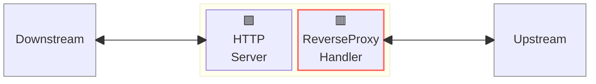
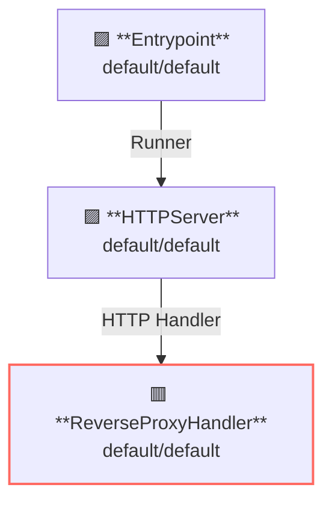

# Reverse Proxy

## Overview

この例はリバースプロキシサーバーを実行します。  
リバースプロキシサーバーは API Gateway の基本的な機能の一つであり、クライアントからのリクエストをアップストリームサービスへプロキシします。

この図は、ゲートウェイ内でプロキシがハンドラーとして動作する様子を示しています。



**凡例**:

- 🟥 `#ff6961` ハンドラーリソース
- 🟩 `#77dd77` ミドルウェアリソース（サーバー側ミドルウェア）
- 🟦 `#89CFF0` トリッパーウェアリソース（クライアント側ミドルウェア）
- 🟪 `#9370DB` その他のリソース

この例では、以下のディレクトリ構成とファイルが想定されています。  
ビルド済みのバイナリが必要な場合は、[GitHub Releases](https://github.com/aileron-gateway/aileron-gateway/releases) からダウンロードしてください。

```txt
reverse-proxy/  ----- 作業ディレクトリ
├── aileron      ----- AILERON Gateway バイナリ (Windowsではaileron.exe)
└── config.yaml  ----- AILERON Gateway configファイル
```

## Config

リバースプロキシサーバーを実行するための設定は次のようになります。

```yaml
# config.yaml

apiVersion: core/v1
kind: Entrypoint
spec:
  runners:
    - apiVersion: core/v1
      kind: HTTPServer

---
apiVersion: core/v1
kind: HTTPServer
spec:
  addr: ":8080"
  virtualHosts:
    - handlers:
        - handler:
            apiVersion: core/v1
            kind: ReverseProxyHandler

---
apiVersion: core/v1
kind: ReverseProxyHandler
spec:
  loadBalancers:
    - pathMatcher:
        match: "/"
        matchType: Prefix
      upstreams:
        - url: http://httpbin.org
```

この設定は次の内容を示しています：

- ポート8080で `HTTPServer` を起動します。
- `/` プレフィックスを持つパスに対して ReverseProxy を適用します。
- アップストリームサービスは [http://httpbin.org](http://httpbin.org) です。

このグラフは、設定におけるリソースの依存関係を示しています。



## Run

AILERON Gateway を以下のコマンドで起動します：

```bash
./aileron -f ./config.yaml
```

## Check

リバースプロキシサーバーを起動したら、そのサーバーに対して HTTP リクエストを送信してください。

リバースプロキシサーバーが正しく動作していれば、JSON レスポンスが返されます。

```bash
$ curl http://localhost:8080/get
{
  "args": {},
  "headers": {
    "Accept": "*/*",
    "Host": "httpbin.org",
    "User-Agent": "curl/7.68.0",
    "X-Amzn-Trace-Id": "Root=1-68146a36-66235c683c6d7ae90b60c969",
    "X-Forwarded-Host": "localhost:8080"
  },
  "origin": "127.0.0.1, 106.73.5.65",
  "url": "http://localhost:8080/get"
}
```

## Customizing

### 複数のアップストリームサーバ

この YAML は、異なる重みを持つ複数のアップストリームを設定しています。

```yaml
apiVersion: core/v1
kind: ReverseProxyHandler
spec:
  loadBalancers:
    - pathMatcher:
        match: "/"
        matchType: Prefix
      upstreams:
        - url: http://ipconfig.io
          weight: 2
        - url: http://ifconfig.io
          weight: 1
```

### パスプレフィックスの変更

パスのプレフィックスは追加または削除することができます。  
`pathMatcher.trimPrefix` は、**パスマッチの前に** パスのプレフィックスを削除します。  
`pathMatcher.appendPrefix` は、**パスマッチの後に** パスのプレフィックスを追加します。

```yaml
apiVersion: core/v1
kind: ReverseProxyHandler
spec:
  loadBalancers:
    - pathMatcher:
        match: "/anything"
        matchType: Prefix
        trimPrefix: "/get" # trimmed befor matching.
      upstreams:
        - url: http://httpbin.org
    - pathMatcher:
        match: "/"
        matchType: Prefix
        appendPrefix: "/anything" # appended after matching.
      upstreams:
        - url: http://httpbin.org
```

## Additional resources

Here's the some nice apis that can be used for testing.

**Available with NO configuration.**

- [http://httpbin.org/](http://httpbin.org/)
- [http://worldtimeapi.org](http://worldtimeapi.org)
- [http://ipconfig.io](http://ipconfig.io)
- [http://ifconfig.io](http://ifconfig.io)
- [http://sse.dev/](http://sse.dev/)
- [https://websocket.org/](https://websocket.org/tools/websocket-echo-server)

**Available after configuration.**

- [https://mockbin.io/](https://mockbin.io/)
- [https://httpdump.app/](https://httpdump.app/)
- [https://webhook.site/](https://webhook.site/)
- [https://beeceptor.com/](https://beeceptor.com/)

**Local mock server.**

- [https://github.com/fortio/fortio](https://github.com/fortio/fortio)
