# Reverse Proxy

## Overview

This example runs a reverse-proxy server.
A revere-proxy server, which is the very basic feature in API Gateways, proxy requests from client to upstream services.

```mermaid

block-beta
  columns 6
  Downstream:1
  space:1
  block:aileron:2
    HTTPServer["🟪</br>HTTP</br>Server"]
    ReverseProxyHandler["🟥</br>ReverseProxy</br>Handler"]
  end
  space:1
  Upstream:1

Downstream --> HTTPServer
HTTPServer --> Downstream
Upstream --> ReverseProxyHandler
ReverseProxyHandler --> Upstream

style Downstream stroke:#888
style Upstream stroke:#888
style ReverseProxyHandler stroke:#ff6961,stroke-width:2px

```



**Legend**:

- 🟥 `#ff6961` Handler resources.
- 🟩 `#77dd77` Middleware resources (Server-side middleware).
- 🟦 `#89CFF0` Tripperware resources (Client-side middleware).
- 🟪 `#9370DB` Other resources.

In this example, following directory structure and files are supposed.

Example resources are available at [examples/reverse-proxy/]({}).
If you need a pre-built binary, download from [GitHub Releases](https://github.com/aileron-gateway/aileron-gateway/releases).

```txt
reverse-proxy/     ----- Working directory.
├── aileron        ----- AILERON Gateway binary (aileron.exe on windows).
└── config.yaml    ----- AILERON Gateway config file.
```

## Config

Configuration yaml to run a reverse-proxy server would becomes as follows.

```yaml
# config.yaml

{}

```

{}

The config tells:

- Start a `HTTPServer` with port 8080.
- ReverseProxy is applied for the path having prefix `/`.
- Upstream service is [http://httpbin.org](http://httpbin.org).

This graph shows the resource dependencies of the configuration.

```mermaid
graph TD
  Entrypoint["🟪 **Entrypoint**</br>default/default"]
  HTTPServer["🟪 **HTTPServer**</br>default/default"]
  ReverseProxyHandler["🟥 **ReverseProxyHandler**</br>default/default"]

Entrypoint --"Runner"--> HTTPServer
HTTPServer --"HTTP Handler"--> ReverseProxyHandler
ReverseProxyHandler

style ReverseProxyHandler stroke:#ff6961,stroke-width:2px
```



## Run

Run the AILERON Gateway with:

```bash
./aileron -f ./config.yaml
```

## Check

After running a reverse-proxy server, send HTTP requests to it.

A json response will be returned when the reverse-proxy server is correctly running.

```bash
$ curl http://localhost:8080/get
{
  "args": {},
  "headers": {
    "Accept": "*/*",
    "Host": "httpbin.org",
    "User-Agent": "curl/7.68.0",
    "X-Amzn-Trace-Id": "Root=1-68146a36-66235c683c6d7ae90b60c969",
    "X-Forwarded-Host": "localhost:8080"
  },
  "origin": "127.0.0.1, 106.73.5.65",
  "url": "http://localhost:8080/get"
}
```

## Additional resources

Here's the some nice apis that can be used for testing.

**Available with NO configuration.**

- [http://httpbin.org/](http://httpbin.org/)
- [http://worldtimeapi.org](http://worldtimeapi.org)
- [http://ipconfig.io](http://ipconfig.io)
- [http://ifconfig.io](http://ifconfig.io)
- [http://ifconfig.io](http://ifconfig.io)
- [http://sse.dev/](http://sse.dev/)
- [https://websocket.org/](https://websocket.org/tools/websocket-echo-server)

**Available after configuration.**

- [https://mockbin.io/](https://mockbin.io/)
- [https://httpdump.app/](https://httpdump.app/)
- [https://webhook.site/](https://webhook.site/)
- [https://beeceptor.com/](https://beeceptor.com/)

**Local mock server.**

- [https://github.com/fortio/fortio](https://github.com/fortio/fortio)
