# SOAP/REST Middleware

## Overview

This example runs a reverse-proxy server with SOAP/REST conversion middleware.
SOAP/REST middleware converts SOAP (xml) request body to REST (json) body.

This example uses a simple echo server as an upstream server.

```mermaid
block-beta
  columns 7
  Downstream:1
  space:1
  block:aileron:3
    HTTPServer["🟪</br>HTTP</br>Server"]
    SOAPRESTMiddleware["🟩</br>SOAPREST</br>Middleware"]
    ReverseProxyHandler["🟥</br>ReverseProxy</br>Handler"]
  end
  space:1
  Upstream:1

  Downstream --> HTTPServer
  HTTPServer --> Downstream
  Upstream --> ReverseProxyHandler
  ReverseProxyHandler --> Upstream

  style Downstream stroke:#888
  style Upstream stroke:#888
  style SOAPRESTMiddleware stroke:#77dd77,stroke-width:2px
  style ReverseProxyHandler stroke:#ff6961,stroke-width:2px
```



**Legend**:

- 🟥 `#ff6961` Handler resources.
- 🟩 `#77dd77` Middleware resources (Server-side middleware).
- 🟦 `#89CFF0` Tripperware resources (Client-side middleware).
- 🟪 `#9370DB` Other resources.

In this example, following directory structure and files are supposed.

Resources are available at [examples/soap-rest/](https://github.com/aileron-gateway/aileron-gateway/tree/main/examples/soap-rest).
If you need a pre-built binary, download from [GitHub Releases](https://github.com/aileron-gateway/aileron-gateway/releases).

```txt
soap-rest/         ----- Working directory.
├── aileron        ----- AILERON Gateway binary (aileron.exe on windows).
├── config.yaml    ----- AILERON Gateway config file.
├── echo.go        ----- A simple echo server.
└── Taskfile.yaml  ----- (Optional) Config file for the go-task.
```

## Config

Configuration yaml to run a reverse-proxy server would becomes as follows.

```yaml
# config.yaml

apiVersion: core/v1
kind: Entrypoint
spec:
  runners:
    - apiVersion: core/v1
      kind: HTTPServer

---
apiVersion: core/v1
kind: HTTPServer
spec:
  addr: ":8080"
  virtualHosts:
    - middleware:
        - apiVersion: app/v1
          kind: SOAPRESTMiddleware
      handlers:
        - handler:
            apiVersion: core/v1
            kind: ReverseProxyHandler

---
apiVersion: core/v1
kind: ReverseProxyHandler
spec:
  loadBalancers:
    - pathMatcher:
        match: ".*"
        matchType: Regex
      upstreams:
        - url: http://localhost:9090/

---
apiVersion: app/v1
kind: SOAPRESTMiddleware
spec:
  simple:
    trimSpace: true
```

The config tells:

- Start a `HTTPServer` with port 8080.
- ReverseProxy is registered to the server (all paths match).
- Apply SOAP/REST middleware to the proxy.
- Proxy upstream is [http://localhost:9090](http://localhost:9090) (This is the echo server).

This graph shows the resource dependencies of the configuration.

```mermaid
graph TD
  Entrypoint["🟪 **Entrypoint**</br>default/default"]
  HTTPServer["🟪 **HTTPServer**</br>default/default"]
  SOAPRESTMiddleware["🟩 **SOAPRESTMiddleware**</br>default/default"]
  ReverseProxyHandler["🟥 **ReverseProxyHandler**</br>default/default"]

  Entrypoint --> HTTPServer
  HTTPServer --> ReverseProxyHandler
  HTTPServer --> SOAPRESTMiddleware
  ReverseProxyHandler

  style SOAPRESTMiddleware stroke:#77dd77,stroke-width:2px
  style ReverseProxyHandler stroke:#ff6961,stroke-width:2px
```



## Run

### (Option 1) Directory run the binary

Before running the AILERON Gateway, start a simple echo server using [./echo.go](./echo.go).
This required `go` command.
The echo server listens on the port `:9090` by default.

```bash
go run ./echo.go
```

Then, run the AILERON Gateway in another terminal with the command.

```bash
./aileron -f ./config.yaml
```

### (Option 2) Use taskfile

`Taskfile.yaml` is available to run the example.
Install [go-task](https://taskfile.dev/) and run the following command.

This runs both echo server and AILERON Gateway.
Note that it also requires `go` command to run the echo server.

```bash
task
```

or with arbitrary binary path.

```bash
task AILERON_CMD="./path/to/aileron/binary"
```

## Check

After running a reverse-proxy server with SOAP/REST middleware,
send SOAP requests to it.

**SOAP 1.1 requires:**

- `Content-Type: text/xml` request header.
- `SOAPAction` request header.
- Body with valid xml format.

This is an example request of SOAP 1.1.
The body must be in valid xml format but not necessarily be in SOAP 1.1 format.

```bash
curl -H "Content-Type: text/xml" \
    -H "SOAPAction: dummy" \
    http://localhost:8080 \
    --data @- <<EOF

<alice xmlns="http://abc.com/" xmlns:ns="http://xyz.com/">
  <bob>charlie</bob>
  <ns:david>edgar</ns:david>
</alice>
EOF
```

Its response will be

```xml
<?xml version="1.0" encoding="UTF-8"?>
<alice xmlns="http://abc.com/" xmlns:ns="http://xyz.com/">
  <ns:david>edgar</ns:david>
  <bob>charlie</bob>
</alice>
```

**SOAP 1.2 requires:**

- `Content-Type: application/soap+xml` request header.
- Body with valid xml format.

This is an example request of SOAP 1.2.
The body must be in valid xml format but not necessarily be in SOAP 1.2 format.

```bash
curl -H "Content-Type: application/soap+xml" \
    http://localhost:8080 \
    --data @- <<EOF

<alice xmlns="http://abc.com/" xmlns:ns="http://xyz.com/">
  <bob>charlie</bob>
  <ns:david>edgar</ns:david>
</alice>
EOF
```

Its response will be

```xml
<?xml version="1.0" encoding="UTF-8"?>
<alice xmlns="http://abc.com/" xmlns:ns="http://xyz.com/">
  <ns:david>edgar</ns:david>
  <bob>charlie</bob>
</alice>
```

## Modify error response

AILERON Gateway returns error response in default format such as

```bash
$ curl http://localhost:8080
{"status":403,"statusText":"Forbidden"}
```

or

```bash
$ curl -H "Accept: text/xml" http://localhost:8080
<result>
  <status>403</status>
  <statusText>Forbidden</statusText>
  <errors></errors>
</result>
```

These error responses can be replaced by configuring error handler resource.
See the example config [./config-error.yaml](./config-error.yaml) for detail.
