# Static Handler

## Overview

This example runs a template server that returns response generated from templates.

```mermaid
block-beta
  columns 4
  Downstream:1
  space:1
  block:aileron:2
    HTTPServer["🟪</br>HTTP</br>Server"]
    StaticHandler["🟥</br>Static</br>Handler"]
  end

  Downstream --> HTTPServer

  style StaticHandler stroke:#ff6961,stroke-width:2px
```



**Legend**:

- 🟥 `#ff6961` Handler resources.
- 🟩 `#77dd77` Middleware resources (Server-side middleware).
- 🟦 `#89CFF0` Tripperware resources (Client-side middleware).
- 🟪 `#9370DB` Other resources.

In this example, following directory structure and files are supposed.

Resources are available at [examples/static/](https://github.com/aileron-gateway/aileron-gateway/tree/main/examples/static).
If you need a pre-built binary, download from [GitHub Releases](https://github.com/aileron-gateway/aileron-gateway/releases).

```txt
template/          ----- Working directory.
├── aileron        ----- AILERON Gateway binary (aileron.exe on windows).
├── config.yaml    ----- AILERON Gateway config file.
├── root/          ----- Root directory that contains served contents.
└── Taskfile.yaml  ----- (Optional) Config file for the go-task.
```

## Config

Configuration yaml to run a server with template handler would becomes as follows.

```yaml
# config.yaml

apiVersion: core/v1
kind: Entrypoint
spec:
  runners:
    - apiVersion: core/v1
      kind: HTTPServer

---
apiVersion: core/v1
kind: HTTPServer
spec:
  addr: ":8080"
  virtualHosts:
    - handlers:
        - handler:
            apiVersion: core/v1
            kind: StaticFileHandler

---
apiVersion: core/v1
kind: StaticFileHandler
spec:
  rootDir: "./root/"
  enableListing: true
  header: # Additional response headers.
    Cache-Control: no-cache
```

The config tells:

- Start a `HTTPServer` with port 8080.
- Static handler is registered to the server (all paths match).
  - Use `./root/` directory as root path.

This graph shows the resource dependencies of the configuration.

```mermaid
graph TD
  Entrypoint["🟪 **Entrypoint**</br>default/default"]
  HTTPServer["🟪 **HTTPServer**</br>default/default"]
  StaticHandler["🟥</br>**StaticHandler**</br>default/default"]

  Entrypoint --> HTTPServer
  HTTPServer --> StaticHandler

  style StaticHandler stroke:#ff6961,stroke-width:2px
```



## Run

### (Option 1) Directory run the binary

```bash
./aileron -f ./config.yaml
```

### (Option 2) Use taskfile

`Taskfile.yaml` is available to run the example.
Install [go-task](https://taskfile.dev/) and run the following command.

```bash
task
```

or with arbitrary binary path.

```bash
task AILERON_CMD="./path/to/aileron/binary"
```

## Check

After running a server, send HTTP requests to it.
Content type of response bodies are sniffed by Go's [DetectContentType](https://pkg.go.dev/net/http#DetectContentType).

```json
$ curl http://localhost:8080/hello.json

{ "hello": "AILERON Gateway" }
```

```xml
$ curl http://localhost:8080/hello.xml

<hello>AILERON Gateway</hello>
```
