# Template Handler

## Overview

This example runs a template server that returns response generated from templates.

```mermaid
block-beta
  columns 4
  Downstream:1
  space:1
  block:aileron:2
    HTTPServer["🟪</br>HTTP</br>Server"]
    TemplateHandler["🟥</br>Template</br>Handler"]
  end

Downstream --> HTTPServer

style TemplateHandler stroke:#ff6961,stroke-width:2px
```



**Legend**:

- 🟥 `#ff6961` Handler resources.
- 🟩 `#77dd77` Middleware resources (Server-side middleware).
- 🟦 `#89CFF0` Tripperware resources (Client-side middleware).
- 🟪 `#9370DB` Other resources.

In this example, following directory structure and files are supposed.

Example resources are available at [examples/template/]({}).
If you need a pre-built binary, download from [GitHub Releases](https://github.com/aileron-gateway/aileron-gateway/releases).

```txt
template/          ----- Working directory.
├── aileron        ----- AILERON Gateway binary (aileron.exe on windows).
├── config.yaml    ----- AILERON Gateway config file.
└── template.html  ----- A example template for the TemplateHandler.
```

## Config

Configuration yaml to run a server with template handler would becomes as follows.

```yaml
# config.yaml

{}
```

The config tells:

- Start a `HTTPServer` with port 8080.
- Template handler is registered to the server (all paths match).
- 3 templates are registered to the template handler.
  - A text template for `Accept: text/plain`
  - A go's text template for `Accept: application/json`
  - A go's html template for `Accept: text/html`

This graph shows the resource dependencies of the configuration.

```mermaid
graph TD
  Entrypoint["🟪 **Entrypoint**</br>default/default"]
  HTTPServer["🟪 **HTTPServer**</br>default/default"]
  TemplateHandler["🟥</br>**TemplateHandler**</br>default/default"]

Entrypoint --"Runner"--> HTTPServer
HTTPServer --"HTTP Handler"--> TemplateHandler

style TemplateHandler stroke:#ff6961,stroke-width:2px
```



## Run

Run the AILERON Gateway with command:

```bash
./aileron -f ./config.yaml
```

## Check

After running a server, send HTTP requests to it.

Request with `Accept: text/plain` header to obtain templated response for the mime type.

```text
$ curl -H "Accept: text/plain" http://localhost:8080/

Hello! AILERON Gateway!
```

`Accept: application/json` should also works to obtain json response.

Go's [text/template](https://pkg.go.dev/text/template) can be used for `GoText` template type.

```json
$ curl -H "Accept: application/json" http://localhost:8080/

{
  "hello": "AILERON Gateway!"
}
```

`Accept: text/html` returns response with embedded information.

Go's [html/template](https://pkg.go.dev/html/template) can be used for `GoHTML` template type.

```html
$ curl -H "Accept: text/html" http://localhost:8080/

<!doctype html>
<html>
<head>
  <title>AILERON Gateway</title>
</head>
<body>
  <h1>AILERON Gateway</h1>
  <p>
    proto : HTTP/1.1</br>
    host : localhost:8080</br>
    method : GET</br>
    path : /</br>
    remote : 127.0.0.1:46818</br>
    header : map[Accept:[text/html] User-Agent:[curl/7.68.0]]</br>
    User-Agent : [curl/7.68.0]</br>
    query : map[]</br>
  </p>
</body>
</html>
```

If templates are not defined requested by an `Accept` header, 406 Not Acceptable error will be returned.

```json
curl -H "Accept: text/css" http://localhost:8080/

{"status":406,"statusText":"Not Acceptable"}
```
