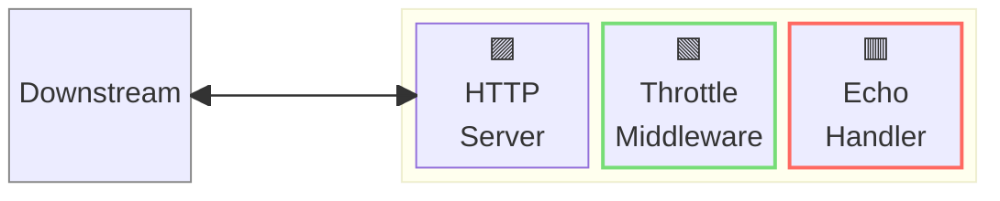
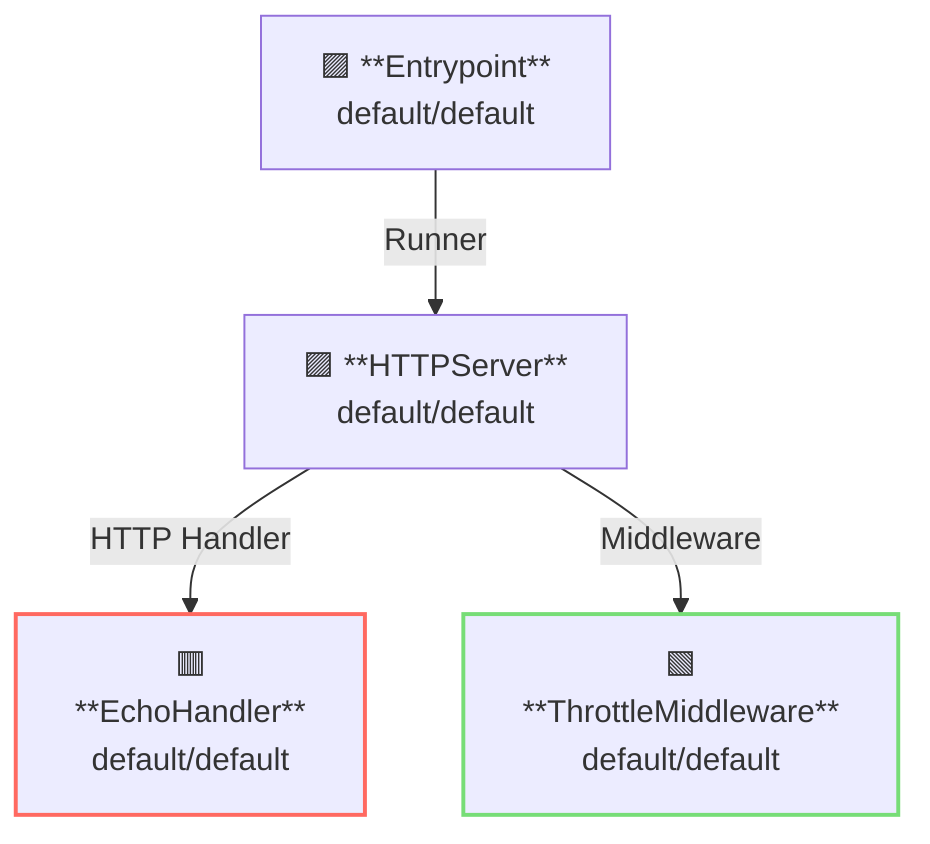

# Throttle Middleware

## 概要

この例では、スロットルミドルウェア付きのリバースプロキシサーバを起動します。  
スロットルミドルウェアは、サーバに対してスロットリング（またはレート制限）を適用します。  
この例では、リバースプロキシの代わりにEchoHandlerを使用しており、多数のリクエストを同時に送信することが可能です。



**凡例**:

- 🟥 `#ff6961` ハンドラーリソース  
- 🟩 `#77dd77` ミドルウェアリソース（サーバーサイドミドルウェア）  
- 🟦 `#89CFF0` トリッパーウェアリソース（クライアントサイドミドルウェア）  
- 🟪 `#9370DB` その他のリソース  

この例では、以下のディレクトリ構成およびファイルが想定されています。  
ビルド済みバイナリが必要な場合は、[GitHub Releases](https://github.com/aileron-gateway/aileron-gateway/releases)からダウンロードしてください。

```txt
throttle/        ----- Working directory.
├── aileron      ----- AILERON Gateway バイナリ (aileron.exe on windows).
└── config.yaml  ----- AILERON Gateway configファイル.
```

## Config

スロットルミドルウェア付きのechoサーバを実行するための YAML は次のようになります。

```yaml
# config.yaml

apiVersion: core/v1
kind: Entrypoint
spec:
  runners:
    - apiVersion: core/v1
      kind: HTTPServer

---
apiVersion: core/v1
kind: HTTPServer
spec:
  addr: ":8080"
  virtualHosts:
    - middleware:
        - apiVersion: app/v1
          kind: ThrottleMiddleware
      handlers:
        - handler:
            apiVersion: app/v1
            kind: EchoHandler

---
apiVersion: app/v1
kind: EchoHandler

---
apiVersion: app/v1
kind: ThrottleMiddleware
spec:
  apiThrottlers:
    - matcher:
        matchType: Regex
        patterns:
          - ".*"
      fixedWindow:
        windowSize: 1000
        limit: 10
```

この設定は以下を示しています：

- ポート8080で `HTTPServer` を起動する。
- エコーハンドラーをサーバーに登録する（全パスにマッチ）。
- エコーハンドラーにスロットルミドルウェアを適用する。
- スロットルは **Fixed Window** アルゴリズムを使用する。
  - ウィンドウサイズは1000ms（1秒）。
  - そのウィンドウ内で10リクエストを許可。

この図は設定のリソース依存関係を示しています。



## Run

AILERON Gateway を以下のコマンドで起動します:

```bash
./aileron -f ./config.yaml
```

## Check

スロットルミドルウェア付きのサーバーを起動したら、HTTPリクエストを送信してください。
ただし、単一のリクエストを送るだけではスロットリングが正しく機能しているか確認できない点に注意してください。

```bash
$ curl http://localhost:8080/
---------- Request ----------
Proto   : HTTP/1.1
Host   : localhost:8080
Method : GET
URI    : /
Path   : /
Query  :
Remote : 127.0.0.1:34044
---------- Header ----------
{
  "Accept": [
    "*/*"
  ],
  "User-Agent": [
    "curl/7.68.0"
  ]
}
---------- Body ----------

--------------------------
```

スロットルミドルウェアが動作しているか確認するには、負荷テストツールを使います。

ここでは [oha](https://github.com/hatoo/oha) を使用しています。  
以下のコマンドは、秒間15リクエストを10秒間送信します。  
結果として、スロットルミドルウェアによって制限されたリクエストに対して 429 Too Many Requests エラーが返されることが確認できます。

```bash
$ oha -z 10s -q 15 http://localhost:8080

~~ Output omitted ~~

Status code distribution:
  [200] 105 responses
  [429] 45 responses

~~ Output omitted ~~
```

## Additional resources

負荷テストツールとしては以下のようなツールが利用可能です。

- [wrk](https://github.com/wg/wrk)
- [wrk2](https://github.com/giltene/wrk2)
- [k6](https://github.com/grafana/k6)
- [oha](https://github.com/hatoo/oha)
- [Vegeta](https://github.com/tsenart/vegeta)
- [Locust](https://github.com/locustio/locust)
