# Throttle Middleware

## Overview

This example runs a reverse-proxy server with throttle middleware.
Throttle middleware apply throttling, or rate limiting, to the server.
In this example, echo handler is used rather than a reverse proxy so you can send many requests concurrently.

```mermaid
block-beta
  columns 5
  Downstream:1
  space:1
  block:aileron:3
    HTTPServer["🟪</br>HTTP</br>Server"]
    ThrottleMiddleware["🟩</br>Throttle</br>Middleware"]
    EchoHandler["🟥</br>Echo</br>Handler"]
  end

Downstream --> HTTPServer
HTTPServer --> Downstream

style Downstream stroke:#888
style ThrottleMiddleware stroke:#77dd77,stroke-width:2px
style EchoHandler stroke:#ff6961,stroke-width:2px
```



**Legend**:

- 🟥 `#ff6961` Handler resources.
- 🟩 `#77dd77` Middleware resources (Server-side middleware).
- 🟦 `#89CFF0` Tripperware resources (Client-side middleware).
- 🟪 `#9370DB` Other resources.

In this example, following directory structure and files are supposed.

Resources are available at [examples/throttle/](https://github.com/aileron-gateway/aileron-gateway/tree/main/examples/throttle).
If you need a pre-built binary, download from [GitHub Releases](https://github.com/aileron-gateway/aileron-gateway/releases).

```txt
throttle/          ----- Working directory.
├── aileron        ----- AILERON Gateway binary (aileron.exe on windows).
├── config.yaml    ----- AILERON Gateway config file.
└── Taskfile.yaml  ----- (Optional) Config file for the go-task.
```

## Config

Configuration yaml to run a echo server with throttle middleware would becomes as follows.

```yaml
# config.yaml

apiVersion: core/v1
kind: Entrypoint
spec:
  runners:
    - apiVersion: core/v1
      kind: HTTPServer

---
apiVersion: core/v1
kind: HTTPServer
spec:
  addr: ":8080"
  virtualHosts:
    - middleware:
        - apiVersion: app/v1
          kind: ThrottleMiddleware
      handlers:
        - handler:
            apiVersion: app/v1
            kind: EchoHandler

---
apiVersion: app/v1
kind: EchoHandler

---
apiVersion: app/v1
kind: ThrottleMiddleware
spec:
  apiThrottlers:
    - methods: []
      matcher:
        matchType: Regex
        patterns:
          - ".*"
      fixedWindow:
        windowSize: 1000
        limit: 10
```

The config tells:

- Start a `HTTPServer` with port 8080.
- Echo handler is registered to the server (all paths match).
- Apply throttle middleware to the echo handler.
- Use **Fixed Window** algorithm for throttling.
  - Window size is 1000ms, or 1 second.
  - Allow 10 requests in the window.

This graph shows the resource dependencies of the configuration.

```mermaid
graph TD
  Entrypoint["🟪 **Entrypoint**</br>default/default"]
  HTTPServer["🟪 **HTTPServer**</br>default/default"]
  ThrottleMiddleware["🟩</br>**ThrottleMiddleware**</br>default/default"]
  EchoHandler["🟥</br>**EchoHandler**</br>default/default"]

Entrypoint --> HTTPServer
HTTPServer --> EchoHandler
HTTPServer --> ThrottleMiddleware

style ThrottleMiddleware stroke:#77dd77,stroke-width:2px
style EchoHandler stroke:#ff6961,stroke-width:2px
```



## Run

### (Option 1) Directory run the binary

```bash
./aileron -f ./config.yaml
```

### (Option 2) Use taskfile

`Taskfile.yaml` is available to run the example.
Install [go-task](https://taskfile.dev/) and run the following command.

```bash
task
```

or with arbitrary binary path.

```bash
task AILERON_CMD="./path/to/aileron/binary"
```

## Check

After running a server with throttle middleware, send HTTP requests to it.
Note that we cannot check if the throttling is working or not when just sending a single request.

```bash
$ curl http://localhost:8080/
---------- Request ----------
Proto   : HTTP/1.1
Host   : localhost:8080
Method : GET
URI    : /
Path   : /
Query  :
Remote : 127.0.0.1:34044
---------- Header ----------
{
  "Accept": [
    "*/*"
  ],
  "User-Agent": [
    "curl/7.68.0"
  ]
}
---------- Body ----------

--------------------------
```

To see the throttle middleware is working. Use some load testing tools.

[oha](https://github.com/hatoo/oha) is used here.
Following command sends 15 requests/sec for 10 seconds.
The result shows that 429 TooManyRequest error is returned for requests limited by the throttle middleware.

```bash
$ oha -z 10s -q 15 http://localhost:8080

~~ Output omitted ~~

Status code distribution:
  [200] 105 responses
  [429] 45 responses

~~ Output omitted ~~
```

## Additional resources

Here's some load testing tools.

- [wrk](https://github.com/wg/wrk)
- [wrk2](https://github.com/giltene/wrk2)
- [k6](https://github.com/grafana/k6)
- [oha](https://github.com/hatoo/oha)
- [Vegeta](https://github.com/tsenart/vegeta)
- [Locust](https://github.com/locustio/locust)
