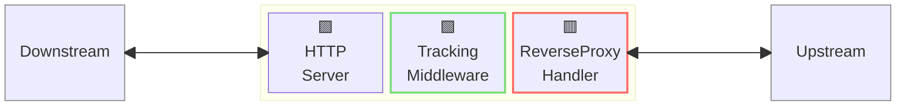
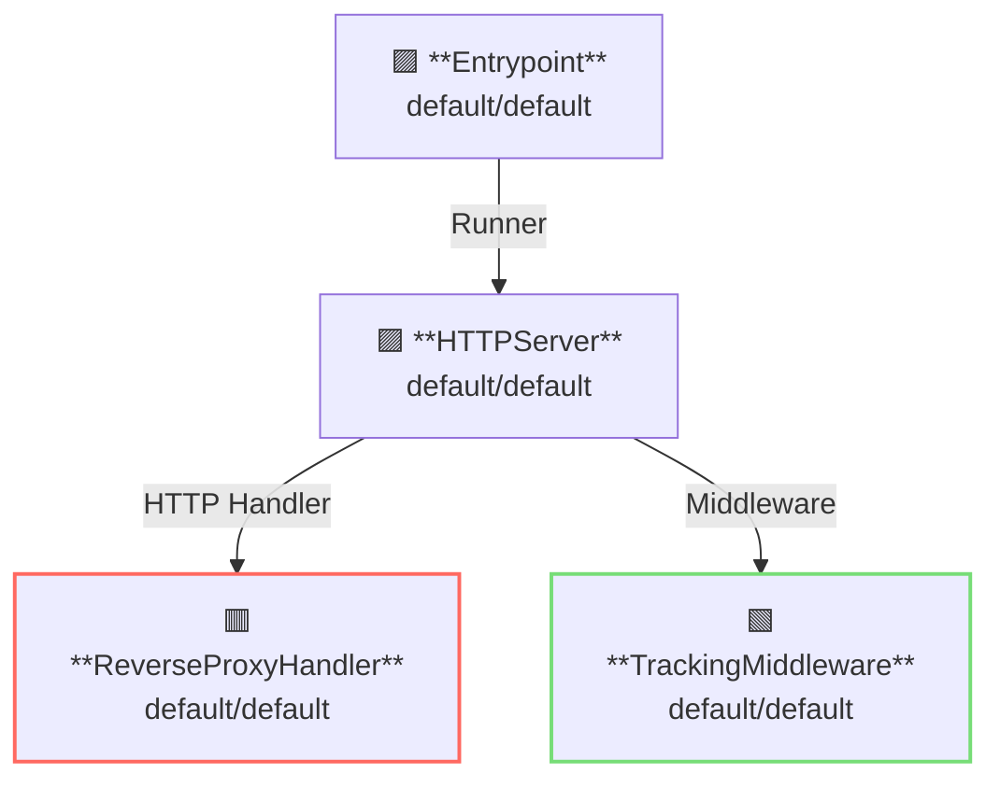

# Tracking Middleware

## 概要

この例では、トラッキングミドルウェアを備えたリバースプロキシサーバーを実行します。  
トラッキングミドルウェアは、リクエストIDやトレースIDの管理機能を提供します。



**凡例**:

- 🟥 `#ff6961` ハンドラーリソース
- 🟩 `#77dd77` ミドルウェアリソース（サーバー側ミドルウェア）
- 🟦 `#89CFF0` トリッパーウェアリソース（クライアント側ミドルウェア）
- 🟪 `#9370DB` その他のリソース

この例では、以下のディレクトリ構成とファイルが想定されています。  
ビルド済みのバイナリが必要な場合は、[GitHub Releases](https://github.com/aileron-gateway/aileron-gateway/releases) からダウンロードしてください。

```txt
tracking/        ----- 作業ディレクトリ
├── aileron      ----- AILERON Gateway バイナリ (Windowsではaileron.exe)
└── config.yaml  ----- AILERON Gateway configファイル.
```

## Config

リバースプロキシサーバーを実行するための設定は以下のようになります。

```yaml
# config.yaml

apiVersion: core/v1
kind: Entrypoint
spec:
  runners:
    - apiVersion: core/v1
      kind: HTTPServer

---
apiVersion: core/v1
kind: HTTPServer
spec:
  addr: ":8080"
  virtualHosts:
    - middleware:
        - apiVersion: app/v1
          kind: TrackingMiddleware
      handlers:
        - handler:
            apiVersion: core/v1
            kind: ReverseProxyHandler

---
apiVersion: core/v1
kind: ReverseProxyHandler
spec:
  loadBalancers:
    - pathMatcher:
        match: "/"
        matchType: Prefix
      upstreams:
        - url: http://httpbin.org

---
apiVersion: app/v1
kind: TrackingMiddleware
spec:
  requestIDProxyName: X-Aileron-Request-ID
  traceIDProxyName: X-Aileron-Trace-ID
```

この設定は以下の内容を示しています：

- ポート `8080` で `HTTPServer` を起動します。
- すべてのパスにマッチするように `ReverseProxy` をサーバーに登録します。
- プロキシにはTrackingMiddlewareを適用します。
- プロキシのアップストリームは [http://httpbin.org](http://httpbin.org) です。

以下のグラフは、この構成におけるリソースの依存関係を示しています。



## Run

以下のコマンドで AILERON Gateway を実行します：

```bash
./aileron -f ./config.yaml
```

## Check

トラッキングミドルウェア付きのリバースプロキシサーバを起動した後、HTTPリクエストを送信します。

リバースプロキシサーバが正しく動作していれば、JSONレスポンスが返されます。

以下の内容を確認できます：

- `X-Aileron-Request-Id` がプロキシリクエストに含まれている。
- `X-Aileron-Trace-Id` がプロキシリクエストに含まれている。

```bash
$ curl http://localhost:8080/get
{
  "args": {},
  "headers": {
    "Accept": "*/*",
    "Host": "httpbin.org",
    "User-Agent": "curl/7.68.0",
    "X-Aileron-Request-Id": "00338GYPDSUVFQ4KRDD6QVX8VPH9UVGHRG5QNZZBH2V9Y0XN",
    "X-Aileron-Trace-Id": "00338GYPDSUVFQ4KRDD6QVX8VPH9UVGHRG5QNZZBH2V9Y0XN",
    "X-Amzn-Trace-Id": "Root=1-681623e8-0f9880644a116cbe4ee1db61",
    "X-Forwarded-Host": "localhost:8080"
  },
  "origin": "127.0.0.1, 106.73.5.65",
  "url": "http://localhost:8080/get"
}
```
