# Tracking Middleware

## Overview

This example runs a reverse-proxy server with tracking middleware.
Tracking middleware have ability to handle request IDs and tracing IDs.

```mermaid
block-beta
  columns 7
  Downstream:1
  space:1
  block:aileron:3
    HTTPServer["🟪</br>HTTP</br>Server"]
    TrackingMiddleware["🟩</br>Tracking</br>Middleware"]
    ReverseProxyHandler["🟥</br>ReverseProxy</br>Handler"]
  end
  space:1
  Upstream:1

Downstream --> HTTPServer
HTTPServer --> Downstream
Upstream --> ReverseProxyHandler
ReverseProxyHandler --> Upstream

style Downstream stroke:#888
style Upstream stroke:#888
style TrackingMiddleware stroke:#77dd77,stroke-width:2px
style ReverseProxyHandler stroke:#ff6961,stroke-width:2px
```



**Legend**:

- 🟥 `#ff6961` Handler resources.
- 🟩 `#77dd77` Middleware resources (Server-side middleware).
- 🟦 `#89CFF0` Tripperware resources (Client-side middleware).
- 🟪 `#9370DB` Other resources.

In this example, following directory structure and files are supposed.

Example resources are available at [examples/tracking/]({}).
If you need a pre-built binary, download from [GitHub Releases](https://github.com/aileron-gateway/aileron-gateway/releases).

```txt
tracking/          ----- Working directory.
├── aileron        ----- AILERON Gateway binary (aileron.exe on windows).
└── config.yaml    ----- AILERON Gateway config file.
```

## Config

Configuration yaml to run a reverse-proxy server would becomes as follows.

```yaml
# config.yaml

{}
```

The config tells:

- Start a `HTTPServer` with port 8080.
- ReverseProxy is registered to the server (all paths match).
- Apply tracking middleware to the proxy.
- Proxy upstream is [http://httpbin.org](http://httpbin.org).

This graph shows the resource dependencies of the configuration.

```mermaid
graph TD
  Entrypoint["🟪 **Entrypoint**</br>default/default"]
  HTTPServer["🟪 **HTTPServer**</br>default/default"]
  TrackingMiddleware["🟩</br>**TrackingMiddleware**</br>default/default"]
  ReverseProxyHandler["🟥</br>**ReverseProxyHandler**</br>default/default"]

Entrypoint --"Runner"--> HTTPServer
HTTPServer --"HTTP Handler"--> ReverseProxyHandler
HTTPServer --"Middleware"--> TrackingMiddleware

style TrackingMiddleware stroke:#77dd77,stroke-width:2px
style ReverseProxyHandler stroke:#ff6961,stroke-width:2px
```



## Run

Run the AILERON Gateway with command:

```bash
./aileron -f ./config.yaml
```

## Check

After running a reverse-proxy server with tracking middleware, send HTTP requests to it.

A json response will be returned when the reverse-proxy server is correctly running.

We can check

- `X-Aileron-Request-Id` is added to the proxy request.
- `X-Aileron-Trace-Id` is added to the proxy request.

```bash
$ curl http://localhost:8080/get
{
  "args": {},
  "headers": {
    "Accept": "*/*",
    "Host": "httpbin.org",
    "User-Agent": "curl/7.68.0",
    "X-Aileron-Request-Id": "00338GYPDSUVFQ4KRDD6QVX8VPH9UVGHRG5QNZZBH2V9Y0XN",
    "X-Aileron-Trace-Id": "00338GYPDSUVFQ4KRDD6QVX8VPH9UVGHRG5QNZZBH2V9Y0XN",
    "X-Amzn-Trace-Id": "Root=1-681623e8-0f9880644a116cbe4ee1db61",
    "X-Forwarded-Host": "localhost:8080"
  },
  "origin": "127.0.0.1, 106.73.5.65",
  "url": "http://localhost:8080/get"
}
```
