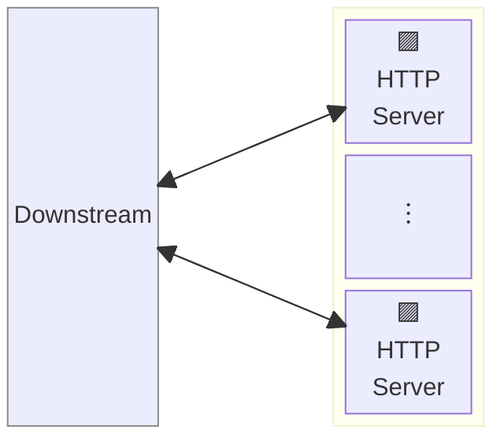
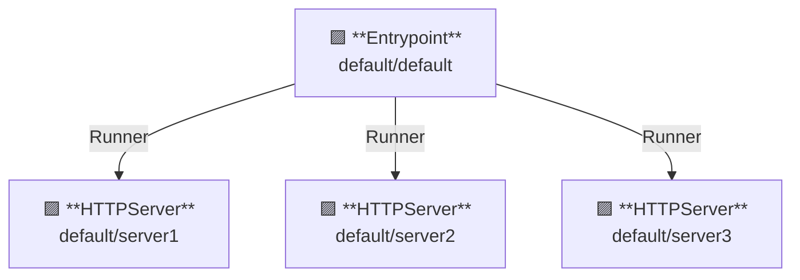

# Vanillaサーバ

## 概要

この例では、バニラサーバー（vanilla server）を起動します。  
バニラサーバーは特に機能を持たず、常に 404 NotFound を返します。

AILERON Gateway は、1つのプロセスで複数のサーバーを実行することをサポートしています。



**凡例**:

- 🟥 `#ff6961` ハンドラーリソース
- 🟩 `#77dd77` ミドルウェアリソース（サーバー側ミドルウェア）
- 🟦 `#89CFF0` トリッパーウェアリソース（クライアント側ミドルウェア）
- 🟪 `#9370DB` その他のリソース

この例では、以下のディレクトリ構成とファイルが想定されています。  
ビルド済みのバイナリが必要な場合は、[GitHub Releases](https://github.com/aileron-gateway/aileron-gateway/releases) からダウンロードしてください。

```txt
vanilla-server/  ----- 作業ディレクトリ
├── aileron      ----- AILERON Gateway バイナリ (Windowsではaileron.exe)
└── config.yaml  ----- AILERON Gateway configファイル.
```

## Config

複数のバニラサーバーを実行するための YAML 設定は以下のようになります。  

```yaml
# config.yaml

apiVersion: core/v1
kind: Entrypoint
spec:
  runners:
    - apiVersion: core/v1
      kind: HTTPServer
      name: server1
    - apiVersion: core/v1
      kind: HTTPServer
      name: server2
    - apiVersion: core/v1
      kind: HTTPServer
      name: server3

---
apiVersion: core/v1
kind: HTTPServer
metadata:
  name: server1
spec:
  addr: ":8081"

---
apiVersion: core/v1
kind: HTTPServer
metadata:
  name: server2
spec:
  addr: ":8082"

---
apiVersion: core/v1
kind: HTTPServer
metadata:
  name: server3
spec:
  addr: ":8083"
```

この構成は以下を示しています：

- ポート8081、8082、8083で3つの `HTTPServer` を起動する。
- 各サーバーには `server1`、`server2`、`server3` という名前が付けられている。
- サーバ以外の機能は利用していない。

このグラフは、リソースの依存関係を示しています。



## Run

AILERON Gatewayは以下のコマンドで起動します：

```bash
./aileron -f ./config.yaml
```

## Check

サーバーを起動した後、HTTPリクエストを送信してください。

バニラサーバーが正しく動作していれば、JSON形式のレスポンスが返されます。

ただし、バニラサーバーにはハンドラーが登録されていないため、**404 NotFound**が返される点に注意してください。

```bash
$ curl http://localhost:8081
{"status":404,"statusText":"Not Found"}
```

```bash
$ curl http://localhost:8082
{"status":404,"statusText":"Not Found"}
```

```bash
$ curl http://localhost:8083
{"status":404,"statusText":"Not Found"}
```
