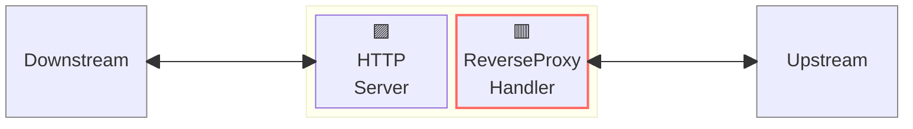
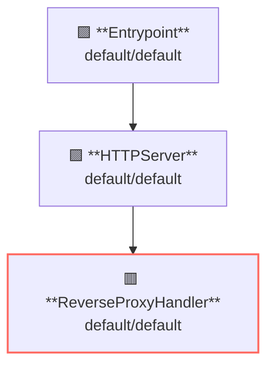

# Vanilla Server

## Overview

This example runs a vanilla server.
A vanilla-server does not have any features but returns 404 NotFound.



**Legend**:

- 🟥 `#ff6961` Handler resources.
- 🟩 `#77dd77` Middleware resources (Server-side middleware).
- 🟦 `#89CFF0` Tripperware resources (Client-side middleware).
- 🟪 `#9370DB` Other resources.

In this example, following directory structure and files are supposed.

Resources are available at [_example/reverse-proxy/](https://github.com/aileron-gateway/aileron-gateway/tree/main/_example/reverse-proxy).
If you need a pre-built binary, download from [GitHub Releases](https://github.com/aileron-gateway/aileron-gateway/releases).

```txt
reverse-proxy/     ----- Working directory.
├── aileron        ----- AILERON Gateway binary (aileron.exe on windows).
├── config.yaml    ----- AILERON Gateway config file.
└── Taskfile.yaml  ----- (Optional) Config file for the go-task.
```

## Config

Configuration yaml to run a reverse-proxy server would becomes as follows.

```yaml
# config.yaml

apiVersion: core/v1
kind: Entrypoint
spec:
  runners:
    - apiVersion: core/v1
      kind: HTTPServer

---
apiVersion: core/v1
kind: HTTPServer
spec:
  addr: ":8080"
  virtualHosts:
    - handlers:
        - handler:
            apiVersion: core/v1
            kind: ReverseProxyHandler

---
apiVersion: core/v1
kind: ReverseProxyHandler
spec:
  loadBalancers:
    - pathMatcher:
        match: "/"
        matchType: Prefix
      upstreams:
        - url: http://httpbin.org
```

The config tells:

- Start a `HTTPServer` with port 8080.
- ReverseProxy is applied for the path having prefix `/`.
- Upstream service is [http://httpbin.org](http://httpbin.org).

This graph shows the resource dependencies of the configuration.



## Run

### (Option 1) Run the binary directly

```bash
./aileron -f ./config.yaml
```

### (Option 1) Run using taskfile

`Taskfile.yaml` is exist in the [_example/reverse-proxy/](https://github.com/aileron-gateway/aileron-gateway/tree/main/_example/reverse-proxy) for convenience.
The example can be run using [go-task](https://taskfile.dev/) just running the following command.

```bash
task
```

or with arbitrary binary path.

```bash
task AILERON_CMD="./path/to/aileron/binary"
```

Defined tasks:

- `task`: Alias for the `task single`.
- `task single`: Runs `config-single.yaml`.
- `task multiple`: Runs `config-multiple.yaml`.

## Check

After running a reverse-proxy server, send HTTP requests to it.

A json response will be returned when the reverse-proxy server is correctly running.

```bash
$ curl http://localhost:8080/get
{
  "args": {},
  "headers": {
    "Accept": "*/*",
    "Host": "httpbin.org",
    "User-Agent": "curl/7.68.0",
    "X-Amzn-Trace-Id": "Root=1-68146a36-66235c683c6d7ae90b60c969",
    "X-Forwarded-Host": "localhost:8080"
  },
  "origin": "127.0.0.1, 106.73.5.65",
  "url": "http://localhost:8080/get"
}
```

## Additional resources

Here's the some nice apis that can be used for testing.

**Available with NO configuration.**

- [http://httpbin.org/](http://httpbin.org/)
- [http://worldtimeapi.org](http://worldtimeapi.org)
- [http://ipconfig.io](http://ipconfig.io)
- [http://ifconfig.io](http://ifconfig.io)
- [http://ifconfig.io](http://ifconfig.io)
- [http://sse.dev/](http://sse.dev/)

**Available after configuration.**

- [https://mockbin.io/](https://mockbin.io/)
- [https://httpdump.app/](https://httpdump.app/)
- [https://webhook.site/](https://webhook.site/)
- [https://beeceptor.com/](https://beeceptor.com/)
