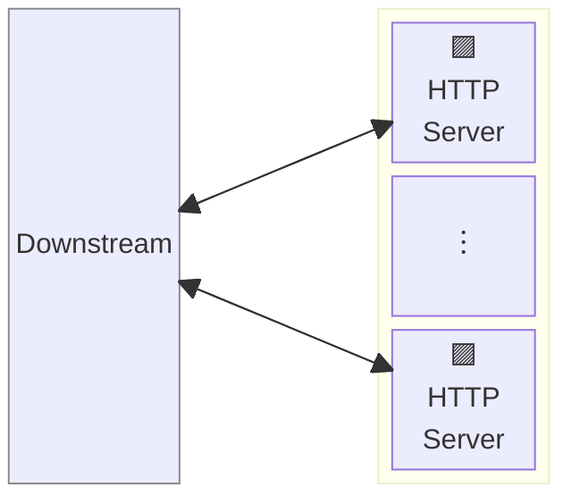
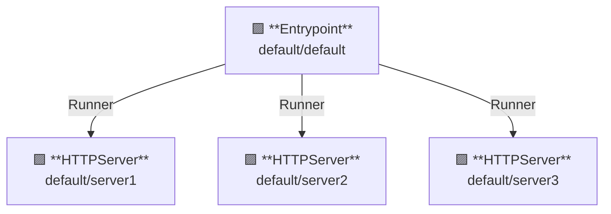

# Vanilla Server

## Overview

This example runs a vanilla server.
A vanilla-server does not have any feature but returns 404 NotFound.

AILERON Gateway supports running multiple servers in a single process.



**Legend**:

- 🟥 `#ff6961` Handler resources.
- 🟩 `#77dd77` Middleware resources (Server-side middleware).
- 🟦 `#89CFF0` Tripperware resources (Client-side middleware).
- 🟪 `#9370DB` Other resources.

In this example, following directory structure and files are supposed.

Example resources are available at [examples/vanilla-server/]({}).
If you need a pre-built binary, download from [GitHub Releases](https://github.com/aileron-gateway/aileron-gateway/releases).

```txt
vanilla-server/           ----- Working directory.
├── aileron               ----- AILERON Gateway binary (aileron.exe on windows).
├── config-single.yaml    ----- AILERON Gateway config file for single server.
└── config-multiple.yaml  ----- AILERON Gateway config file for multiple servers.
```

## Config

Configuration yaml to run multiple vanilla servers would becomes as follows.
Config for a single server would be more simple than this (See the config-single.yaml).

```yaml
# config-multiple.yaml

{}
```

The config tells:

- Start 3 `HTTPServer` with port 8081, 8082 and 8083.
- Each server has their name `server1`, `server2` and `server3`.
- No other features are applied.

This graph shows the resource dependencies of the configuration.



## Run

Run the AILERON Gateway with command:

```bash
./aileron -f ./config-multiple.yaml
```

## Check

After running servers, send HTTP requests to it.

A json response will be returned when the vanilla servers are correctly running.
Note that the vanilla servers returns **404 NotFound** because no handlers are registered to them.

```bash
$ curl http://localhost:8081
{"status":404,"statusText":"Not Found"}
```

```bash
$ curl http://localhost:8082
{"status":404,"statusText":"Not Found"}
```

```bash
$ curl http://localhost:8083
{"status":404,"statusText":"Not Found"}
```
