# Vanilla Server

## Overview

This example runs a vanilla server.
A vanilla-server does not have any feature but returns 404 NotFound.

AILERON Gateway supports running multiple servers in a single process.

```mermaid
block-beta
  columns 3
  Downstream:1
  space:1
  block:aileron:1
    columns 1
    HTTPServer1["🟪</br>HTTP</br>Server"]
    ︙
    HTTPServer2["🟪</br>HTTP</br>Server"]
  end

Downstream --> HTTPServer1
HTTPServer1 --> Downstream
Downstream --> HTTPServer2
HTTPServer2 --> Downstream

style Downstream stroke:#888
```



**Legend**:

- 🟥 `#ff6961` Handler resources.
- 🟩 `#77dd77` Middleware resources (Server-side middleware).
- 🟦 `#89CFF0` Tripperware resources (Client-side middleware).
- 🟪 `#9370DB` Other resources.

In this example, following directory structure and files are supposed.

Resources are available at [examples/vanilla-server/](https://github.com/aileron-gateway/aileron-gateway/tree/main/examples/vanilla-server).
If you need a pre-built binary, download from [GitHub Releases](https://github.com/aileron-gateway/aileron-gateway/releases).

```txt
vanilla-server/           ----- Working directory.
├── aileron               ----- AILERON Gateway binary (aileron.exe on windows).
├── config-single.yaml    ----- AILERON Gateway config file for single server.
├── config-multiple.yaml  ----- AILERON Gateway config file for multiple servers.
└── Taskfile.yaml         ----- (Optional) Config file for the go-task.
```

## Config

Configuration yaml to run multiple vanilla servers would becomes as follows.
Config for a single server would be more simple than this (See the config-single.yaml).

```yaml
# config-multiple.yaml

{}
```

The config tells:

- Start 3 `HTTPServer` with port 8081, 8082 and 8083.
- Each server has their name `server1`, `server2` and `server3`.
- No other features are applied.

This graph shows the resource dependencies of the configuration.

```mermaid
graph TD
  Entrypoint["🟪 **Entrypoint**</br>default/default"]
  HTTPServer1["🟪 **HTTPServer**</br>default/server1"]
  HTTPServer2["🟪 **HTTPServer**</br>default/server2"]
  HTTPServer3["🟪 **HTTPServer**</br>default/server3"]

  Entrypoint --> HTTPServer1
  Entrypoint --> HTTPServer2
  Entrypoint --> HTTPServer3
```



## Run

### (Option 1) Directory run the binary

```bash
./aileron -f ./config-multiple.yaml
```

### (Option 2) Use taskfile

`Taskfile.yaml` is available to run the example.
Install [go-task](https://taskfile.dev/) and run the following command.

```bash
task
```

or with arbitrary binary path.

```bash
task AILERON_CMD="./path/to/aileron/binary"
```

## Check

After running servers, send HTTP requests to it.

A json response will be returned when the vanilla servers are correctly running.
Note that the vanilla servers returns **404 NotFound** because no handlers are registered to them.

```bash
$ curl http://localhost:8081
{"status":404,"statusText":"Not Found"}
```

```bash
$ curl http://localhost:8082
{"status":404,"statusText":"Not Found"}
```

```bash
$ curl http://localhost:8083
{"status":404,"statusText":"Not Found"}
```
